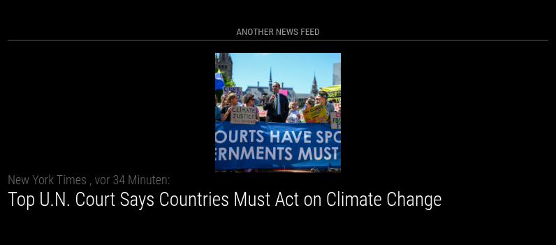

# MMM-anotherNewsFeed

**MMM-anotherNewsFeed** is a MagicMirror module that displays news feeds from various sources. It allows you to customize the feeds, censor specific words, and choose whether to show images.

This module is a modified version of the default [newsfeed](https://github.com/MagicMirrorOrg/MagicMirror/tree/master/modules/default/newsfeed) module. This was inspired by a request in the forum: <https://forum.magicmirror.builders/topic/16933/developer-wanted-to-modify-default-newsfeed-module>.

## Screenshot



## Installation

Navigate to your MagicMirror modules directory, clone this repository and install the dependencies:

```bash
cd ~/MagicMirror/modules
git clone https://github.com/MMRIZE/MMM-anotherNewsFeed
cd MMM-anotherNewsFeed
npm ci
```

## Update

To update the module, navigate to the module directory, pull the latest changes and reinstall the dependencies:
```bash
cd ~/MagicMirror/modules/MMM-anotherNewsFeed
git pull
npm ci
```

## Configuration

### Configuration example

Add the following configuration example to your `config.js` file:

```js
    {
      module: "MMM-anotherNewsFeed",
      header: "ANOTHER News Feed",
      position: "bottom_bar",
      config: {
        censorWords: ["Some", "improper words", "here"],
        feeds: [
          {
            title: "New York Times",
            url: "https://rss.nytimes.com/services/xml/rss/nyt/HomePage.xml"
          },
          {
            title: "CBC World",
            url: "https://www.cbc.ca/webfeed/rss/rss-world"
          },
          {
            title: "BBC World News",
            url: "https://feeds.bbci.co.uk/news/world/rss.xml"
          }
        ],
        showImage: true,
      }
    },
```

### Configuration options

| Option | Type | Default | Description |
|---|---:|---|---|
| `feeds` | array | `[{ title: "New York Times", url: "https://rss.nytimes.com/services/xml/rss/nyt/HomePage.xml", encoding: "UTF-8" }]` | List of feed objects. Each feed object can contain `title`, `url` and optional `encoding` (e.g. `"UTF-8"` or `"ISO-8859-1"`). |
| `showAsList` | boolean | `false` | When true, show feed items as a static list instead of rotating one-by-one. |
| `showSourceTitle` | boolean | `true` | Show the source/title of the feed for each item. |
| `showPublishDate` | boolean | `true` | Show the publish date for each item. |
| `broadcastNewsFeeds` | boolean | `true` | Broadcast the full news feed via MagicMirror notifications (`NEWS_FEED`). |
| `broadcastNewsUpdates` | boolean | `true` | Broadcast only newly added items via `NEWS_FEED_UPDATE` notifications. |
| `showDescription` | boolean | `false` | Show the item description (summary) with the title. Can be toggled at runtime. |
| `showTitleAsUrl` | boolean | `false` | Treat the title as a URL (render title as link when appropriate). |
| `wrapTitle` | boolean | `true` | Allow title text to wrap to multiple lines. |
| `wrapDescription` | boolean | `true` | Allow description text to wrap to multiple lines. |
| `truncDescription` | boolean | `true` | Truncate long descriptions to `lengthDescription` characters when true. |
| `lengthDescription` | number | `400` | Maximum number of characters for truncated descriptions (used when `truncDescription` is true). |
| `hideLoading` | boolean | `false` | If true, the module hides the loading indicator when first loaded. |
| `reloadInterval` | number (ms) | `5 * 60 * 1000` (300000) | How often the backend fetches the RSS feeds (milliseconds). Default is 5 minutes. |
| `updateInterval` | number (ms) | `10 * 1000` (10000) | Interval between switching visible items (milliseconds). |
| `animationSpeed` | number (ms) | `2.5 * 1000` (2500) | DOM update/transition animation duration in milliseconds. |
| `maxNewsItems` | number | `0` (0 = unlimited) | Maximum number of news items to keep/display. 0 means no limit. |
| `ignoreOldItems` | boolean | `false` | When true, items older than `ignoreOlderThan` will be ignored. |
| `ignoreOlderThan` | number (ms) | `24 * 60 * 60 * 1000` (86400000) | Age threshold (milliseconds) for ignoring old items when `ignoreOldItems` is enabled. Default 1 day. |
| `removeStartTags` | string | `""` (empty) | Controls removal of predefined `startTags` at the start of titles/descriptions. Allowed values: `"title"`, `"description"`, `"both"`, or empty string for none. |
| `removeEndTags` | string | `""` (empty) | Controls removal of predefined `endTags` at the end of titles/descriptions. Use `"title"`, `"description"`, `"both"`, or empty string. |
| `startTags` | array | `[]` | List of strings that should be removed from the start of titles/descriptions when `removeStartTags` is set. |
| `endTags` | array | `[]` | List of strings that should be removed from the end of titles/descriptions when `removeEndTags` is set. |
| `prohibitedWords` | array | `[]` | List of words; items containing any of these words in the title will be filtered out. |
| `scrollLength` | number | `500` | Number of pixels to scroll when showing more details and the full article view is active. |
| `logFeedWarnings` | boolean | `false` | When true, log feed-related warnings to the MagicMirror log. |
| `dangerouslyDisableAutoEscaping` | boolean | `false` | When true, disables automatic escaping of HTML in feed content (use with caution). |
| `showImage` | boolean | `true` | When true, attempts to display images found in the feed items. |
| `censorWords` | array | `[]` | List of words or regex-like fragments to remove from titles and descriptions. |
| `suppressDuplicateTitles` | boolean | `false` | When true, filter out items with duplicate titles. |

## License

This project is licensed under the MIT License - see the [LICENSE](LICENSE.md) file for details.